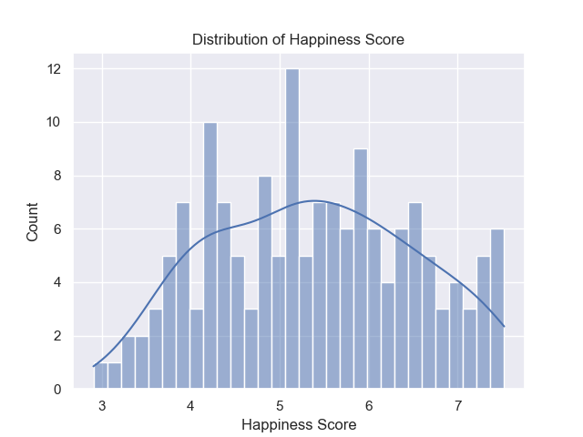
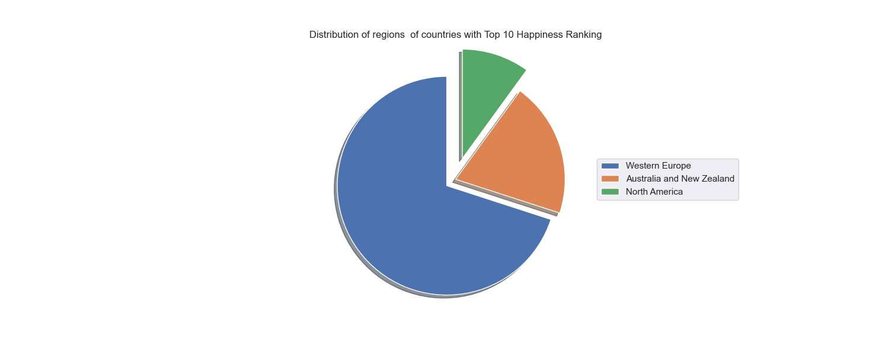
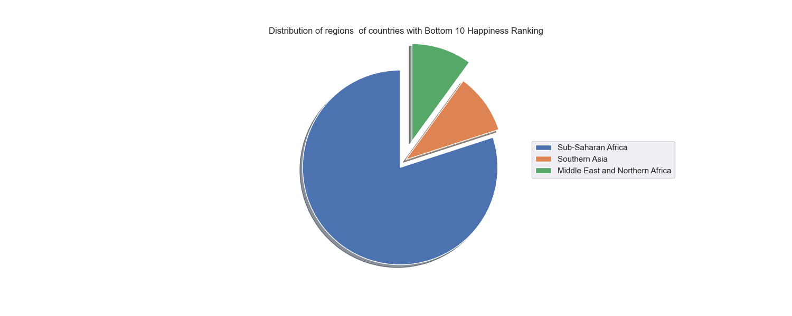
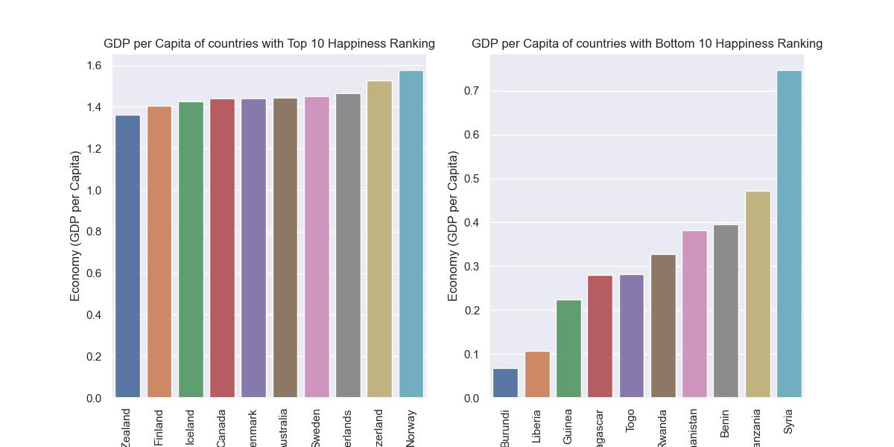
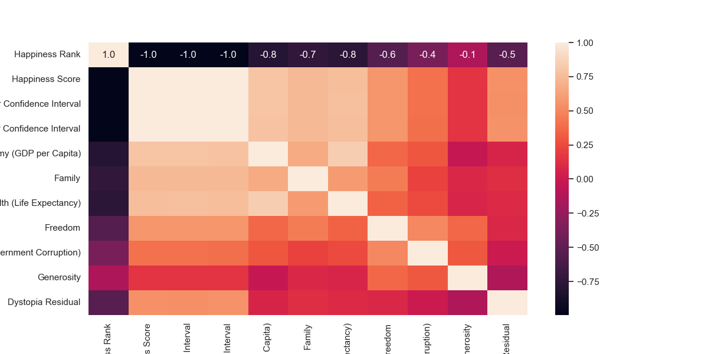
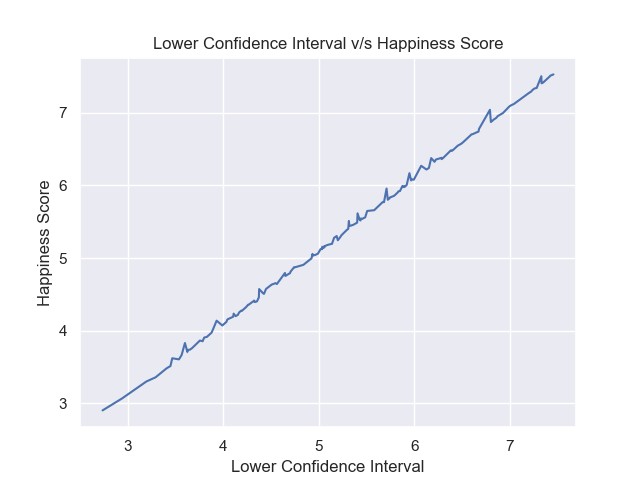
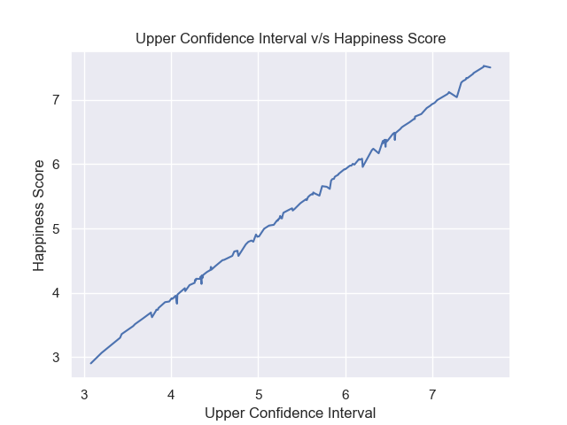
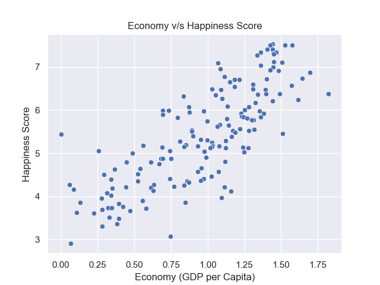
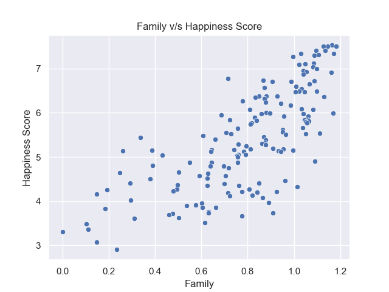
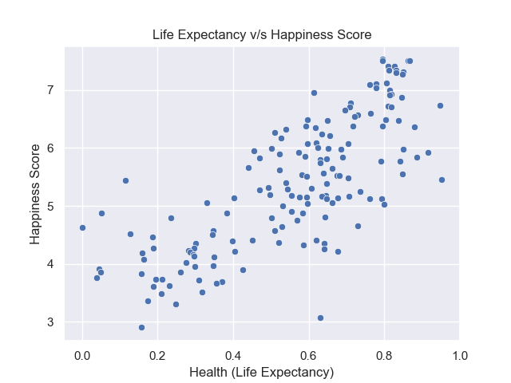

# Data_Visualization_Happiness_Report
Data Visualization Project of Happiness Report 2016

## Run Locally

  

1. Clone the project

  

```bash

git clone https://github.com/sameeksha15/Data_Visualization_Happiness_Report.git

```

  

2. Go to the project directory

  

```bash

cd Data_Visualization_Happiness_Report

```

  

3. Create virtual environment

  

```bash

python -m venv venv

```

  

4. Activate virtual environment

  

- For Windows

```bash

.\venv\Scripts\activate

```

  

- For Unix

```bash

./venv/bin/activate

```

  

5. Install dependencies

  

```bash

pip install -r requirements.txt

```

  

6. Run the jupyter notebook

  

```bash

jupyter notebook .

```

## Dataset

|index|Country|Region|Happiness Rank|Happiness Score|Lower Confidence Interval|Upper Confidence Interval|Economy \(GDP per Capita\)|Family|Health \(Life Expectancy\)|Freedom|Trust \(Government Corruption\)|Generosity|Dystopia Residual|
|---|---|---|---|---|---|---|---|---|---|---|---|---|---|
|0|Denmark|Western Europe|1|7\.526|7\.46|7\.592|1\.44178|1\.16374|0\.79504|0\.57941|0\.44453|0\.36171|2\.73939|
|1|Switzerland|Western Europe|2|7\.509|7\.428|7\.59|1\.52733|1\.14524|0\.86303|0\.58557|0\.41203|0\.28083|2\.69463|
|2|Iceland|Western Europe|3|7\.501|7\.333|7\.669|1\.42666|1\.18326|0\.86733|0\.56624|0\.14975|0\.47678|2\.83137|
|3|Norway|Western Europe|4|7\.498|7\.421|7\.575|1\.57744|1\.1269|0\.79579|0\.59609|0\.35776|0\.37895|2\.66465|
|4|Finland|Western Europe|5|7\.413|7\.351|7\.475|1\.40598|1\.13464|0\.81091|0\.57104|0\.41004|0\.25492|2\.82596|

<br/>

## OUTPUT 

- Plot for "Distribution of Happiness Score"
<br/>

[]()

<br/>
<br/>

- Pie Chart for "Distribution of regions of countries with Top 10 Happiness Ranking"
<br/>

[]()

<br/>
<br/>

- Pie Chart for "Distribution of regions of countries with Bottom 10 Happiness Ranking"
<br/>

[]()

<br/>
<br/>

- Plots for "Ranking of the countries based on GDP per Capita"
<br/>

[]()

<br/>
<br/>

- Heatmap for understanding the correlation between different features
<br/>

[]()

<br/>
<br/>

- Plot for "Lower Confidence Interval v/s Happiness Score"
<br/>

[]()

<br/>
<br/>

- Plot for "Upper Confidence Interval v/s Happiness Score"
<br/>

[]()

<br/>
<br/>

- Plot for "Correlation between Economy and Happiness Score"
<br/>

[]()

<br/>
<br/>

- Plot for "Correlation between Family and Happiness Score"
<br/>

[]()

<br/>
<br/>

- Plot for "Correlation between Life Expectancy and Happiness Score"
<br/>

[]()

